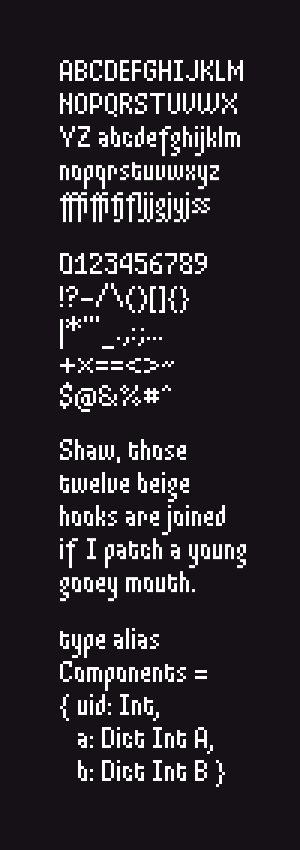

# Mogee Font

This repo contains the source code of the bitmap font that is used in
the [Mogee](https://unsoundscapes.itch.io/mogee) game.



## Instructions

### Running the demo

To see the live-editing example in the browser, first [install Elm](https://guide.elm-lang.org/install.html), and then run:

```sh
elm make src/Main.elm --output index.html && open index.html
```

### Updating the font

This requires Python and PIL installed.

1. Make changes to files `font/` using unicode as filename (ligatures are separated by `_`).
2. Run `./generate-font.py` to update `src/FontData.elm`.
